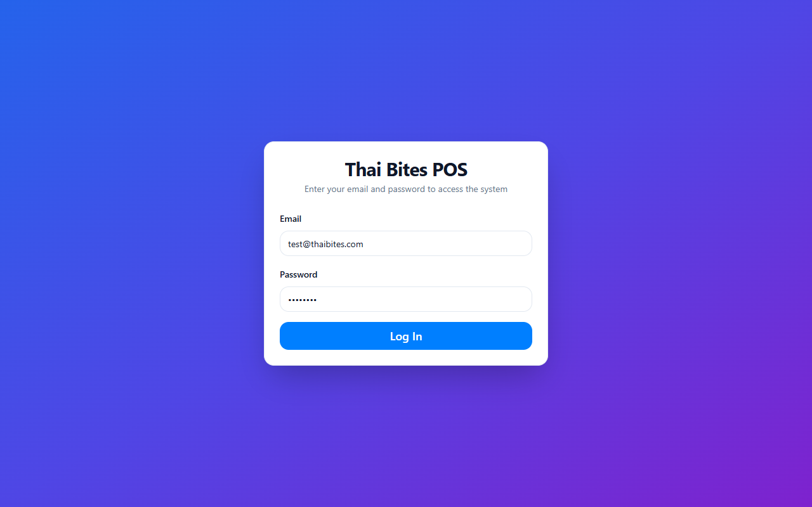
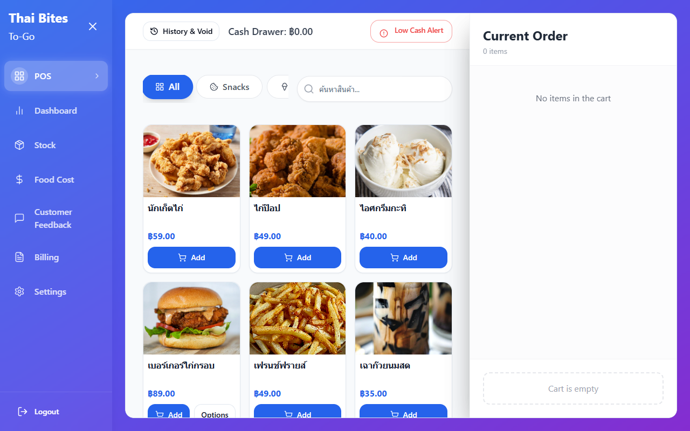
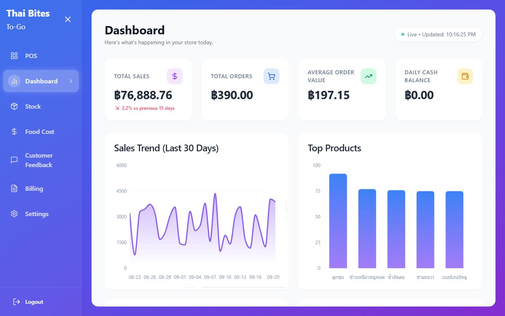
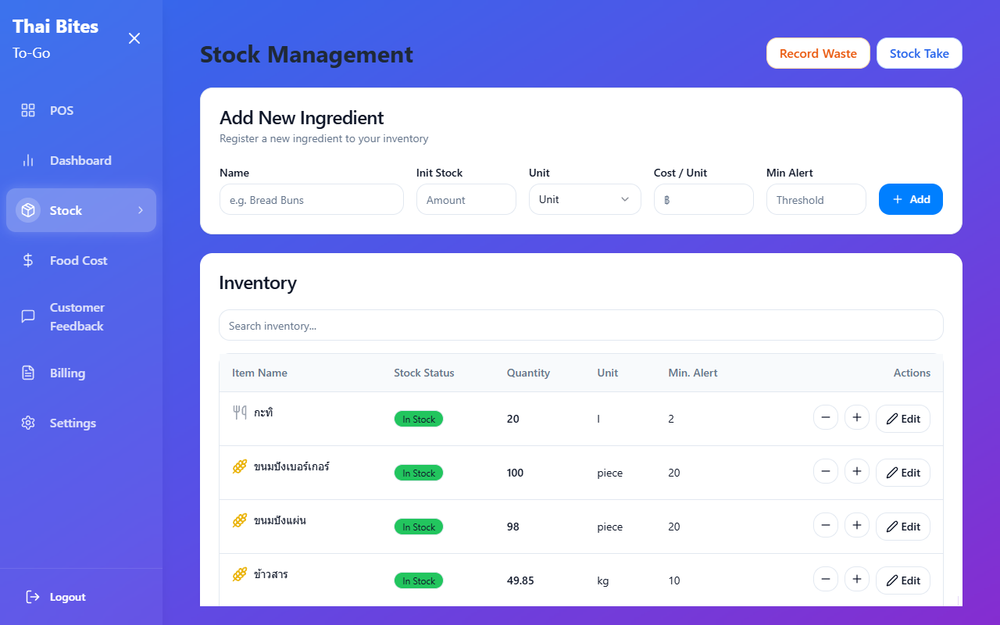
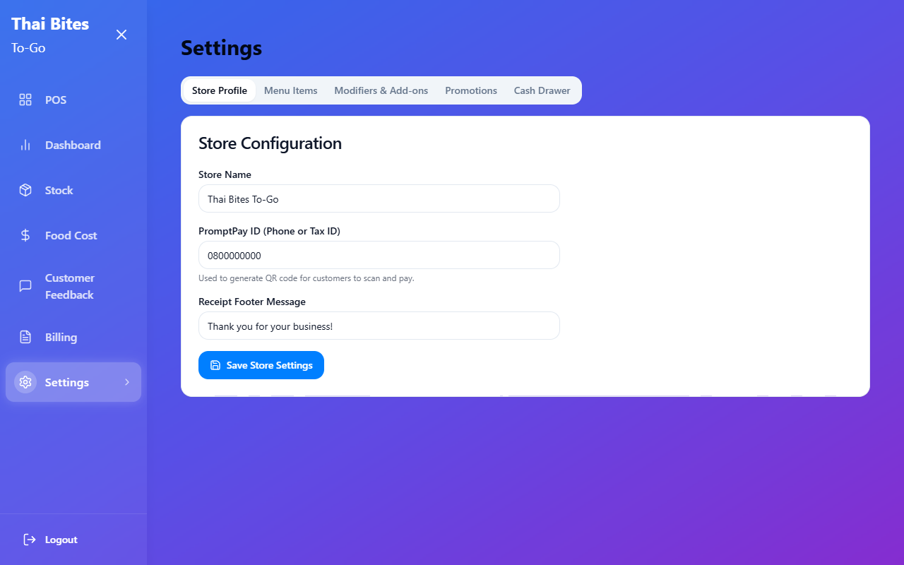
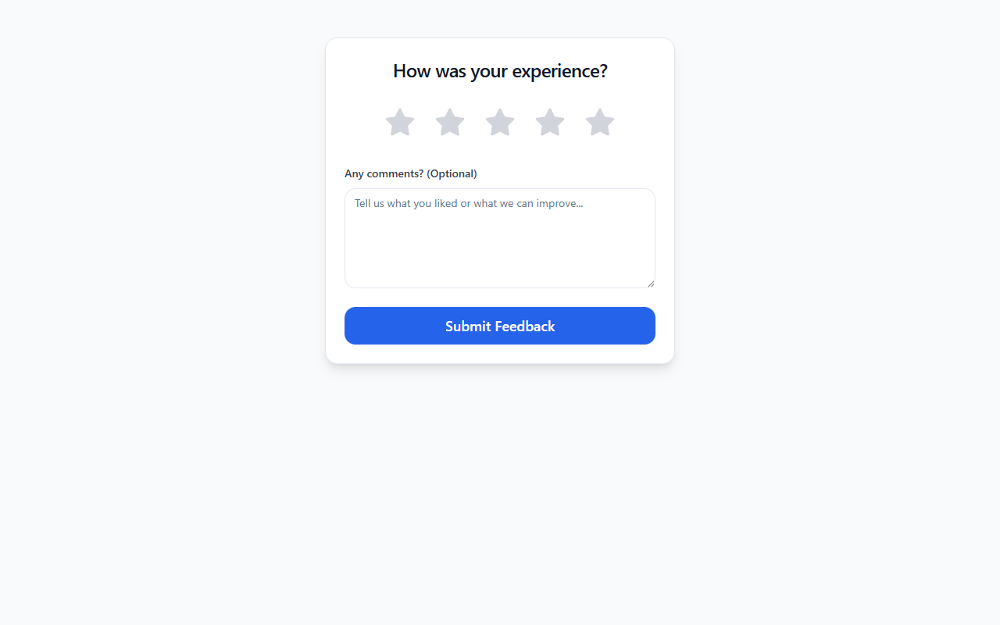

# Thai Bites To-Go (Modern POS System)

A fully-featured, responsive Point of Sale (POS) system built with React, Vite, and Supabase. Designed for food and beverage businesses (like bubble tea shops or restaurants), featuring advanced inventory tracking, dynamic product modifiers, secure authentication, and real-time analytics.

### System Overview
| **Secure Login (Supabase Auth)** | **POS & Checkout** |
| :---: | :---: |
|  |  |
| **Real-time Dashboard** | **Stock Management** |
|  |  |
| **Settings & Modifiers** | **Public Feedback Form** |
|  |  |

## 🚀 Live Demo
**URL:** [https://pos-kappa-azure.vercel.app/](https://pos-kappa-azure.vercel.app/)  
**Test Mode (Sandbox):** `test@thaibites.com` | **Password:** `test1234`
*(Test Mode allows users to interact with the POS, make transactions, and void bills using a local cache without mutating the actual database).*

---

## ✨ Key Features

### 🛡️ Security & Authentication
- **Supabase Auth:** Secure email/password authentication system.
- **Row Level Security (RLS):** Database tables are heavily protected. Only authenticated admins can write to the database.
- **Sandbox Test Mode:** Specific test users are intercepted at the mutation level, allowing them to fully experience the UI and optimistic cache updates without polluting the real database.

### 🛒 Point of Sale (POS)
- **Responsive Layout:** CSS Grid with auto-fill ensures cards adapt perfectly to any screen size or sidebar state.
- **Dynamic Modifiers (Add-ons):** Full database-driven modifier system. Supports single/multiple choices, required fields, and extra pricing.
- **Smart Cart:** Automatically calculates tax, discounts, and modifier prices.
- **Category Icons:** Auto-generates category pills with dynamic Lucide icons based on food types.

### 📦 Advanced Inventory & Stock Management
- **Recipe-based Deduction:** Automatically deducts raw ingredients based on product recipes when a sale is made.
- **Modifier Stock Deduction:** Deducts specific ingredients when customers add toppings (e.g., deducting Boba).
- **Smart Void System (Auto-Refund):** Voiding a transaction automatically recalculates and refunds both base recipe ingredients and modifier ingredients back to the inventory.
- **Waste Log:** Record spoiled or spilled ingredients with reasons to track losses.
- **Low Stock Alerts:** Visual warnings when ingredients fall below their minimum threshold.

### 🧾 Billing & Transaction History
- **Detailed Receipts:** View past transactions with full breakdown of modifiers, add-ons, and customer notes.
- **Void Management:** Securely void incorrect bills with visual tags and auto-stock reconciliation.

### 📊 Real-time Dashboard
- **Smart Sales Trend:** 30-day sales charts dynamically anchor to the *most recent transaction date*, ensuring the graph never appears blank even if the store is closed for days.
- **Business Insights:** Donut charts for Category distribution, Top items, and Payment methods.

### 🗣️ Customer Feedback System
- **Public Endpoint:** An unprotected route `/feedback` where customers can submit 1-5 star ratings and comments.
- **Feedback Analytics:** Dashboard visualizes customer sentiment and average ratings.

### ⚙️ Modern Tech Stack
- **Frontend Framework:** React 18 + Vite
- **Styling:** Tailwind CSS + Shadcn UI (Glassmorphism & Modern Aesthetics)
- **State Management:** React Query (Server State)
- **Database & Backend:** Supabase (PostgreSQL)
- **Data Visualization:** Recharts (Gradients & Custom Tooltips)
- **Icons:** Lucide React

---

## 🛠️ Local Development

1. **Clone the repository**
   ```bash
   git clone https://github.com/PlamGG/POS-React-.git
   cd pos-react
   ```

2. **Install dependencies**
   ```bash
   npm install
   ```

3. **Set up environment variables**
   Create a `.env` file in the root directory and add your Supabase credentials:
   ```env
   VITE_SUPABASE_URL=your_supabase_url
   VITE_SUPABASE_ANON_KEY=your_supabase_anon_key
   ```

4. **Start the development server**
   ```bash
   npm run dev
   ```

---
